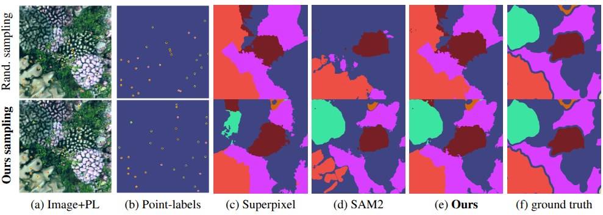

# SparseUWSeg
SparseUWSeg is a framework for efficient multi-class underwater image segmentation that expands sparse point annotations into full masks using a hybrid SAM2–superpixel strategy with active point sampling



## 1. Environment Setup

```bash
conda create -n spuw python=3.10
conda activate spuw
pip install -r requirements.txt
```

## 2. Download Model Checkpoints

```bash
cd checkpoints/
./download_ckpts.sh
```

## 3. CUDA & Driver Recommendations

- This machine uses CUDA 11.5.
- For best performance, use the same CUDA.
- If CUDA is not available, the code will automatically run on CPU.

## 4. Running the Tools

- **Interactive GUI:**
  ```bash
  python app.py
  ```
- **Benchmark/Batch Mode:**
  ```bash
  python run.py
  ```
  (Requires ground truth images for point-label assignment)

## 5. Customizing Experiments

You can modify `run.py` to change experiment parameters and to queue more than one experiment (lines 326-333). These are passed to `auto_labeler.py` and include:

### Key Parameters for `auto_labeler.py`
- `--images` (Path to input images)
- `--ground-truth` (Path to ground truth masks)
- `--points-file` (CSV/JSON file with point annotations)
- `--output` (Output directory)
- `--strategy` (Point selection strategy: list, random, grid and dynamicPoints)
- `--num-points` (Number of points to select per image)
- `--color-dict` (Path to color dictionary JSON)
- `--seed` (Random seed for reproducibility)
- `--visualization` (Enable visualization mode)
- `--maskSLIC` (Enable maskSLIC superpixel expansion)
- `--lambda-balance` (Balance parameter for dynamic strategies)
- `--heatmap-fraction` (Fraction of points from heatmap in dynamic strategies)
- `--debug-expanded-masks` (Debug mode for mask expansion)

### Options you can modify directly in `run.py`
- `experiments` list: queue multiple experiments, set per-experiment parameters
- `common_params`: set parameters shared by all experiments
- `output_dir`: change the base output directory
- `seed`: set the global random seed for reproducibility
- `visualization`: enable/disable visualization mode
- `maskSLIC`: enable/disable maskSLIC superpixel expansion
- `lambda_balance`, `heatmap_fraction`: tune dynamic strategy behavior
- `color_dict`: set the color dictionary for evaluation
- `debug_expanded_masks`: enable debug mode for mask expansion
- Any other parameter supported by `auto_labeler.py` can be added to the experiment or common_params dicts

---
